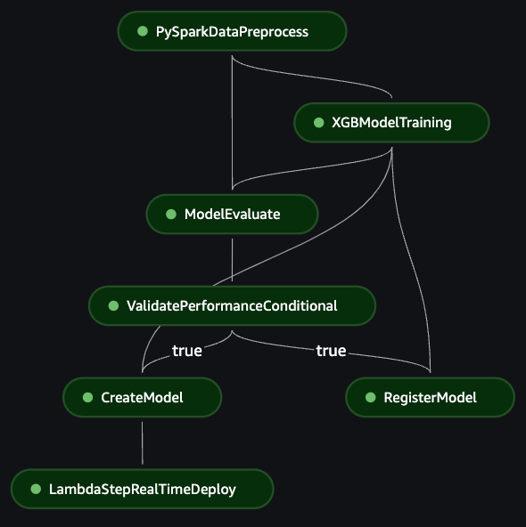

# Caso de Uso de Machine Learning de Ponta a Ponta: Fraude de Crédito
## Índice
1. [Introdução](#1-introdução)
    - [Visão Geral](#visão-geral)
    - [Componentes e Funcionalidades Principais](#componentes-e-funcionalidades-principais)
    - [Fluxo de Trabalho](#fluxo-de-trabalho)
2. [Banco de Dados](#2-banco-de-dados)
    - [Sobre](#sobre)
    - [Organização](#organização)
    - [Download](#download)
3. [Organização do Projeto](#3-organização-do-projeto)
4. [Arquitetura](#4-arquitetura)
    - [Justificativa Tecnológica](#justificativa-tecnológica)
    - [Visão Geral da Arquitetura](#visão-geral-da-arquitetura)
        - [Integração Contínua](#integração-contínua)
        - [Pipeline de Modelos](#pipeline-de-modelos)
        - [Algoritmos de Modelos](#algoritmos-de-modelos)
            - [XGBoost](#xgboost)
            - [LightGBM](#lightgbm)
        - [Implantação](#implantação)
        - [Gerenciamento de Acesso](#gerenciamento-de-acesso)
        - [Armazenamento](#armazenamento)
5. [Plano de Implementação](#5-plano-de-implementação)
    - [Pré-requisitos](#pré-requisitos)
    - [Infraestrutura com CloudFormation](#infraestrutura-com-cloudformation)
    - [Depuração](#depuração)
6. [Configuração](#6-configuração)
    - [Parâmetros](#parâmetros)
        - [Global](#global)
        - [ECS](#ecs)
        - [Preprocessamento](#preprocessamento)
        - [Treinamento](#treinamento)
        - [Avaliação](#avaliação)
        - [Registro](#registro)
        - [Implantação](#implantação-1)
        - [APIGateway](#apigateway)
    - [Variáveis de Ambiente](#variáveis-de-ambiente)
7. [Atualizações Futuras](#7-atualizações-futuras)
    - [Segregação de Contas AWS](#segregação-de-contas-aws)
    - [Exportação de Resultados de Testes Unitários](#exportação-de-resultados-de-testes-unitários)
    - [Isolamento de VPC](#isolamento-de-vpc)
    - [Cobertura Completa do CloudFormation] #TODO
    - [Implementar EKS Substituindo ou Junto com ECS](#implementar-eks-substituindo-ou-junto-com-ecs)
    - [AWS Ground Truth](#aws-ground-truth)
    - [Alertas de Erro](#alertas-de-erro)
    - [Implantações Sombreadas](#implantações-sombreadas)
    - [Glacier para Armazenamento de Longo Prazo](#glacier-para-armazenamento-de-longo-prazo)
    - [Integração com Grafana ou Similar](#integração-com-grafana-ou-similar)
    - [Outros](#outros)
8. [Referências](#8-referências)

## 1. Introdução
Algoritmos de machine learning oferecem meios para analisar dados históricos de transações, identificar padrões e detectar anomalias indicativas de atividades fraudulentas. Esses algoritmos utilizam características como valor da transação, localização, horário, detalhes do comerciante e comportamento do cliente para treinar modelos capazes de distinguir entre transações legítimas e fraudulentas.

Este documento detalha o projeto de Operações de Machine Learning (MLOps) de ponta a ponta, projetado para a detecção de fraudes em crédito. Serão descritos em detalhes a arquitetura e o fluxo de trabalho do projeto, que aproveita componentes da AWS Cloud, particularmente Amazon SageMaker Pipelines, para automatizar e orquestrar o fluxo de trabalho de machine learning.

O objetivo deste projeto é fornecer uma solução robusta e escalável para a detecção de fraudes em crédito, incorporando Integração Contínua/Implantação Contínua (CI/CD), implantação de API e gerenciamento de artefatos. Utilizando serviços da AWS como CodePipeline, CodeBuild, SageMaker e API Gateway, este projeto garante um processo contínuo e eficiente desde a obtenção de dados até a implantação do modelo.

Ao longo desta documentação, serão abordados os componentes e funcionalidades principais do projeto, o fluxo de trabalho envolvido e a organização do conjunto de dados utilizado para treinamento. Também serão apresentadas discussões sobre a arquitetura do projeto, incluindo a justificativa tecnológica para a escolha da AWS como provedor de nuvem.
### Visão Geral
Este documento apresenta a arquitetura e o fluxo de trabalho de um projeto de Operações de Machine Learning (MLOps) de ponta a ponta, projetado para a detecção de fraudes em crédito. O projeto aproveita componentes da AWS Cloud, especialmente Amazon SageMaker Pipelines, para automatizar e orquestrar o fluxo de trabalho de machine learning desde a obtenção de dados até a implantação do modelo. Ele incorpora Integração Contínua/Implantação Contínua (CI/CD), implantação de API e gerenciamento de artefatos para garantir uma solução robusta e escalável.

### Componentes e Funcionalidades Principais
- [x] Obtenção de Dados: Dados são obtidos do Amazon RDS ou S3.
- [x] Gerenciamento de Artefatos e Dados: S3 serve como a principal solução de armazenamento persistente.
- [x] Treinamento de Modelos: Suporta treinamento com modelos XGBoost e LightGBM.
- [x] CI/CD: Utiliza AWS CodePipeline e CodeBuild, integrando com provedores de git para integração e implantação contínuas.
- [x] Testes Unitários: Habilita testes unitários automáticos com CodeBuild e PyTest.
- [x] Docker: Constrói imagem Docker para configurar e acionar etapas e trabalhos do SageMaker Pipeline, garantindo estabilidade e reprodutibilidade.
- [x] Etapas do Pipeline do SageMaker: Inclui pré-processamento de dados com Spark, treinamento de modelos, avaliação de modelos (estimativa de métricas), criação de modelos SageMaker, registro de modelos com MLFlow (incluindo métricas) e implantação de modelos.
- [x] Implantação Automática: Atualiza automaticamente e com segurança a implantação do modelo em execução com capacidades de Auto-Scaling da AWS usando a estratégia Canary.
- [x] Implantação de Endpoint de API: Implanta endpoints para APIs interagirem com os modelos treinados usando AWS API Gateway.
- [x] Segurança e Autenticação: Inclui validações essenciais de credenciais, acesso baseado em funções com AWS IAM.
- [x] Monitoramento de Logs e Pipeline: AWS CloudWatch permite a observabilidade completa dos logs de cada componente.
### Fluxo de Trabalho
- Pipeline de CI/CD:
    - Acompanha automaticamente merges no branch alvo.
    - AWS CodePipeline é usado para automatizar o processo de integração e implantação.
    - Uma imagem Docker é construída para gerenciar as etapas do SageMaker Pipeline.
- Trabalho Completo de Modelo de ML Containerizado:
    - AWS ECS executa o contêiner em atualizações de código ou agendas regulares com AWS EventBridge Scheduler.
- Obtenção e Pré-processamento de Dados:
    - Dados são obtidos do Amazon RDS ou S3.
    - Etapas de pré-processamento com PySpark são aplicadas para limpar e preparar os dados para treinamento.
    - Também suporta Scikit-Learn.
- Treinamento de Modelos:
    - Utiliza modelos XGBoost e LGBM para treinamento.
    - O treinamento é automatizado e gerenciado através do SageMaker Pipelines.
- Avaliação e Registro de Modelos:
    - Modelos são avaliados com base em métricas predefinidas.
    - Modelos abaixo do desempenho mínimo especificado são rejeitados.
    - Modelos bem-sucedidos são registrados com MLFlow, incluindo suas métricas de desempenho.
- Implantação:
    - Modelos são implantados em endpoints do SageMaker.
    - Escalabilidade automática é configurada para lidar com cargas variáveis.
    - Endpoints de API são implantados ou atualizados para permitir a interação com o modelo.

## 2. Banco de Dados
### Sobre
O conjunto de dados aplicado neste caso é composto por características derivadas de transações de cartão de crédito de clientes reais, anonimizadas através da aplicação do método de [Análise de Componentes Principais (PCA)](#PCA) e disponível publicamente online. A escolha deste conjunto de dados se deve às seguintes características e interpretações:
- O conjunto de dados é altamente confiável, limpo e tem a escala apropriada.
- Alinhamento com o campo de interesse do Santander.
- Simplicidade, já que muitas vezes em um cenário real o cientista de dados e o engenheiro de ML criarão pipelines sobre conjuntos de dados consolidados existentes.

### Organização
As características deste conjunto de dados são organizadas conforme o seguinte esquema:

| Tempo   | V1    | V2    | ... | V28   | Quantidade      | Classe         |
| ------- | ----- | ----- | --- | ----- | --------------- | -------------  |
| Inteiro | Float | Float |     | Float | Float Não Sinalizado | Inteiro Binário |
Onde as colunas podem ser descritas da seguinte forma:
- Tempo (int): Tempo em número de segundos decorridos entre esta transação e a primeira transação no conjunto de dados, começando em 0 e terminando em 172792. Ordenado, positivo e não único.
- Características PCA (Float): Características V1 a V28, resultantes da redução dimensional PCA, representando o comportamento, histórico e perfil do cliente.
- Quantidade (Float Não Sinalizado): Valor total da operação.
- Classe (Inteiro Binário): Representação da classe verdadeira para a operação, sendo 0 para não fraude ou 1 para fraude.

### Download
O conjunto de dados está disponível diretamente na [fonte do Kaggle](#KaggleDataset). Posteriormente, este conjunto de dados deve ser carregado no método de fonte AWS preferido, melhor descrito mais adiante nesta documentação.

> [!AVISO]  
> O conjunto de dados foi inserido manualmente em uma tabela equivalente no banco de dados AWS RDS MySQL.
> Como esta configuração está fora do escopo do caso, os detalhes não serão incluídos.
>
> Para testes, o método de fonte mais acessível para o projeto é carregar os dados no AWS S3 e defini-lo como a fonte de dados.

> [!NOTA]  
> Foi realizada uma correção mínima neste conjunto de dados, pois um único valor da coluna `Time` estava preenchido com notação científica e causava comportamentos inesperados em alguns casos.
> O valor foi substituído pela notação não científica.

## 3. Organização do Projeto
Este projeto é totalmente desenvolvido para implantação e integração na AWS Cloud e inclui um pacote Python chamado credit-fraud responsável pelo pipeline do Sagemaker e pelos respectivos jobs.

- pyproject.toml: Arquivo de configuração principal em Python para o pacote credit-fraud. Define muitas variáveis de configuração, como: módulos do pacote, versão e dependências, bem como configurações de teste, metadados e comandos de script de interface gráfica.
- setup.py: Usado pelo pyproject.toml para instalar o pacote credit-fraud.
- Dockerfile: Configurações usadas para construir a imagem do Docker.
- start.sh: Comandos iniciais para a execução da imagem do Docker.
- testspec.yml: Configuração para testes unitários no pipeline de integração contínua. Este arquivo geralmente é gerenciado em um repositório separado.
- buildspec.yml: Configuração para a construção da imagem no pipeline de integração contínua. Este arquivo geralmente é gerenciado em um repositório separado.
- .env: Variáveis de ambiente padrão usadas no projeto.
- credit_fraud: Código-fonte para o pacote credit-fraud, incluindo as configurações do pipeline do Sagemaker, definições de jobs, funções de contexto e ajudantes.
- hooks: Scripts a serem executados fora do escopo de execução do pacote credit-fraud.
- cloudformation: Scripts e modelos de IaaC (Infraestrutura como Código).
- tests: Testes unitários usados na fase de integração contínua.
- models: Diretório de parâmetros de modelos padrão, a ser usado quando as variáveis de ambiente não forem definidas.

## 4. Arquitetura
### Justificativa Tecnológica
Para atender plenamente aos requisitos apresentados, este caso foi projetado para ser totalmente baseado em nuvem desde a concepção, considerando quatro provedores ou qualquer combinação deles: Databricks, AWS, Azure, GCP. As características consideradas incluíram preço, escalabilidade, qualidade da documentação, aderência aos requisitos do projeto, relevância para o Santander, praticidade, integrações, capacidades do ambiente de aprendizado de máquina e experiência pessoal. 

No final, apenas a AWS foi escolhida como provedora. Ao implementar uma arquitetura de MLOps de ponta a ponta, existem várias razões para escolher os serviços da AWS:

1. **Escalabilidade e Flexibilidade**: A AWS oferece uma ampla gama de serviços que podem dimensionar-se facilmente para lidar com grandes volumes de dados e cargas de trabalho. Essa escalabilidade permite o treinamento e implantação eficientes de modelos de aprendizado de máquina, garantindo que a arquitetura possa lidar com demandas crescentes. Todos os componentes integrados são escaláveis horizontalmente ou sem servidor.

2. **Integração e Compatibilidade**: Os serviços da AWS são projetados para funcionar perfeitamente juntos, permitindo fácil integração e compatibilidade entre diferentes componentes da arquitetura de MLOps. Isso garante um fluxo de dados suave e uma comunicação eficiente entre os serviços, reduzindo esforços de desenvolvimento e manutenção. Devido a isso, a arquitetura de várias nuvens era menos viável.

3. **Segurança e Conformidade**: A AWS oferece uma ampla gama de recursos de segurança e certificações de conformidade, garantindo que a arquitetura de MLOps atenda aos padrões da indústria e aos requisitos regulatórios. Isso inclui criptografia, controle de acesso, registro de auditoria e conformidade com regulamentos de proteção de dados.

4. **Monitoramento e Registro**: A AWS fornece serviços robustos de monitoramento e registro, como o CloudWatch, que permitem o monitoramento em tempo real da arquitetura de MLOps. Isso permite a identificação e resolução proativa de problemas, garantindo alta disponibilidade e desempenho do sistema.

Além disso, também vale ressaltar a experiência pessoal do desenvolvedor, na qual trabalhos e treinamentos anteriores foram úteis para realizar a implementação desejada e evitar armadilhas e erros.

Em conclusão, escolher os serviços da AWS, como Amazon SageMaker, Amazon ECS, Amazon S3, Amazon RDS e outros, para implementar uma arquitetura de MLOps de ponta a ponta oferece escalabilidade, flexibilidade, integração e compatibilidade. Esses serviços simplificam o desenvolvimento e a implantação de modelos de aprendizado de máquina, garantem o armazenamento e o gerenciamento eficientes de dados e oferecem recursos robustos de segurança e monitoramento.

### Visão Geral da Arquitetura

A arquitetura completa proposta está representada acima, omitindo algumas operações menores, como persistência de dados, registro e comunicação entre componentes, para melhor compreensão. Essa arquitetura é composta principalmente por três fases: Integração Contínua, Pipeline de Modelos e Implantação.

#### Integração Contínua
Começando com uma mesclagem bem-sucedida de qualquer ramo de origem para o ramo de desenvolvimento do repositório do GitHub, o AWS CodePipeline é acionado automaticamente para uma nova execução de integração. O repositório atualizado é coletado contendo as configurações necessárias para a execução do pipeline. Este pipeline é principalmente sem servidor ou usa IaaC para definir recursos de computação.

Inicialmente, o CodeBuild é invocado para testes unitários, conforme definido no arquivo `testspec.yml` e configurado na seção `tool.pytest.ini_options` do arquivo `pyproject.toml`. Os resultados são registrados em um relatório da tarefa do AWS CodeBuild e podem ser acessados por usuários autorizados para análise. Por fim, se os testes falharem por qualquer motivo, a execução do pipeline também falhará e será interrompida imediatamente. No momento, embora a funcionalidade de teste tenha sido desenvolvida e integrada, existem poucos testes e a cobertura é muito baixa.

Após a aprovação do novo código, a fase de construção, que tem como objetivo criar uma nova imagem de contêiner Docker, é iniciada, também alimentada pelo serviço AWS CodeBuild e configurada pelos arquivos `Dockerfile` e `buildspec.yml`. Em uma construção bem-sucedida, a nova imagem é registrada em um repositório do AWS Elastic Container Registry (ECR). Como esperado, se a construção falhar, a execução do pipeline será interrompida e os logs para depuração estarão disponíveis no AWS CloudWatch.

Vale ressaltar que a imagem construída será registrada com a tag relacionada à versão do projeto, definida no arquivo `pyproject.toml`. A adesão ao controle de versão semântica é, portanto, responsabilidade dos destinatários da solicitação de pull, de acordo com as alterações e atualizações realizadas.

Concluindo a execução, é feita a invocação da função AWS Lambda responsável por atualizar e acionar a tarefa do AWS Elastic Container Service (ECS) com a imagem recém-criada. Conforme declarado no arquivo `credit_fraud/lambda_functions/sources/lambda_run_pipeline.py`, essa função Lambda atualiza a definição da tarefa do ECS com a nova URI da imagem do repositório do ECR, executa essa tarefa atualizada e marca como bem-sucedida a execução do CodePipeline.

Fora do pipeline de integração contínua, o AWS Eventbridge Scheduler é responsável por executar diariamente o treinamento do modelo, mantendo o modelo atualizado assim que novos dados estiverem disponíveis. Essa programação pode ser personalizada, rastreada e novos acionadores podem ser adicionados, como a disponibilização de novos dados.

#### Pipeline de Modelos
A imagem do Docker é responsável pela configuração e implantação de um Pipeline do Sagemaker que realizará tarefas de processamento de dados e treinamento de modelos que exigem recursos de computação escaláveis horizontalmente. Esse pipeline é altamente personalizável usando variáveis de ambiente e é representado com configurações específicas, realizando treinamento e implantação do modelo LGBM da seguinte forma:

Cada execução do pipeline recebe um `execution_id` único, responsável por identificar a execução e isolar seus scripts, dados processados e artefatos ao persistir no bucket do AWS S3.

Começando com a criação de instâncias de pré-processamento de dados em um cluster, esse módulo de processamento padrão da tarefa é o PySpark, mas o Scikit-Learn também é suportado. Os dados atualizados são lidos nas instâncias, processados, divididos em conjuntos de treinamento, validação e teste e salvos na pasta de execução do AWS S3, dentro do diretório `{execution_id}/processed`. Essa tarefa pode ser dimensionada horizontal e verticalmente conforme necessário, e as configurações do Spark são configuradas automaticamente de acordo com o hardware detectado.

Após o processamento bem-sucedido dos dados, o treinamento do modelo suporta tanto modelos XGBoost quanto LGBM. Usando o conjunto de treinamento e validação, o artefato do modelo é treinado, avaliado e seus artefatos são salvos no bucket do AWS S3 na pasta `execution_id`. Além disso, a execução do experimento é registrada em um novo experimento do MLFlow juntamente com suas métricas de validação.

O modelo é posteriormente avaliado na tarefa de avaliação dedicada usando o conjunto de testes, e as métricas de teste também são registradas no experimento do MLFlow. Essas métricas de teste são usadas no portão de validação condicional para garantir a eficiência do novo modelo antes da implantação, caso contrário, interrompendo a execução do pipeline e registrando o motivo da métrica ou métricas abaixo do esperado no AWS CloudWatch para depuração.

Finalmente, uma vez aprovado, o modelo é registrado no MLFlow e criado no Sagemaker como um modelo implantável com definições que fazem referência à imagem do contêiner, endereço URI do artefato e recursos de instância preferenciais. Ao registrar o modelo no MLFlow, ele também é automaticamente registrado na interface de modelo do Sagemaker Studio, permitindo uma visão geral agregada juntamente com o pipeline.

> [!NOTE]  
> [O MLFlow foi recentemente integrado oficialmente ao Sagemaker](#MLFlowSagemaker), anunciado durante o desenvolvimento deste projeto, portanto, não é totalmente suportado por todas as funcionalidades.
> Mudanças específicas foram necessárias para lidar com algumas limitações, como instalar o MLFlow manualmente em alguns contêineres para evitar reconstruí-los.

#### Algoritmos de Modelos
##### XGBoost
O modelo XGBoost, também referenciado como modelo `xgb` no código-fonte, é implementado usando o [framework XGBoost personalizado do Sagemaker](#SagemakerXGBoost), que inclui contêineres para treinamento e inferência. O script de treinamento está localizado em `credit_fraud/pipeline/jobs/xgboost/train.py`, e os parâmetros padrão são encontrados no arquivo `models/xgboost_default.json`. Os parâmetros do modelo podem ser definidos sem a necessidade de gerar uma nova imagem, [usando variáveis de ambiente para substituir os valores padrão](#variaveis-de-ambiente).

##### LightGBM
O LightGBM, também referenciado como modelo `lgbm` no código-fonte, é implementado com uma versão editada do [algoritmo embutido do Sagemaker](#SagemakerLGBM). As alterações estão relacionadas ao suporte ao registro do MLFlow. Assim como o modelo XGBoost, os parâmetros do modelo podem ser substituídos, os arquivos de treinamento podem ser encontrados no diretório `credit_fraud/pipeline/jobs/lgbm` e os parâmetros padrão são armazenados no arquivo `models/lgbm_default.json`.

#### Implantação
A implantação usa o AWS Auto-Scaling para garantir o balanceamento de carga das solicitações recebidas e que o número mínimo esperado de instâncias dos endpoints do Sagemaker esteja em execução e saudável, e dimensiona automaticamente em períodos de maior carga de trabalho, até um máximo. Supondo que o endpoint deva estar online indefinidamente, a [estratégia de atualização Canary](#CanaryUpdate) é realizada quando modelos atualizados estão disponíveis e realiza implantações suaves dos endpoints sobre a estrutura existente. Essa estratégia garante que os novos endpoints atualizados estejam em execução e saudáveis antes de substituir e desativar definitivamente as instâncias desatualizadas.

Ao invocar a função de implantação na etapa final do Pipeline do Sagemaker, o modelo criado é usado para definir uma nova definição de endpoint. Durante a atualização do endpoint, o pipeline aguarda sua conclusão para finalizar com sucesso. Os endpoints ficam disponíveis internamente para usuários autorizados e podem ser invocados diretamente para testes ou fins de desenvolvimento.

Os dois componentes finais da implantação são a função AWS Lambda de inferência e o AWS API Gateway, ambos sem servidor e, portanto, altamente escaláveis. Enquanto o API Gateway é uma API de roteador que funciona como o acesso público para os usuários, ele atua como um proxy e direciona as solicitações para a função Lambda, incluindo o corpo contendo os dados de entrada para a avaliação do modelo. Essa função Lambda é responsável pelo processamento de acordo com a interface do endpoint, que pode variar entre o modelo escolhido (XGBoost ou LGBM), e pela invocação do endpoint específico. A resposta resultante é processada e retornada ao cliente.

#### Gerenciamento de Acesso
O acesso baseado em função do AWS IAM autoriza os componentes a realizar as operações necessárias. O acesso ao ponto de extremidade do modelo é autenticado usando credenciais da AWS. As funções de acesso e as políticas são criadas usando o CloudFormation para este caso, mas em um ambiente de produção real, elas devem ser gerenciadas pela equipe de segurança e autorização. Idealmente, as funções criadas incluem apenas as políticas necessárias para autorizar suas ações e responsabilidades esperadas.

O acesso à API é limitado à chave de API criada automaticamente com o CloudFormation e disponível no console de gerenciamento do AWS API Gateway. Esse método de segurança, além de ser simples, é eficaz, seguro e está associado ao plano de uso que controla o uso da chave e limita sua taxa de solicitação. Novas chaves podem ser geradas, se necessário.

#### Armazenamento
Principalmente, o AWS S3 é usado para armazenar a maioria dos objetos, incluindo metadados subjacentes e outros dados gerados automaticamente por alguns componentes. Cada execução do pipeline do modelo tem seus artefatos, dados de entrada, dados processados, scripts, métricas e metadados gerais registrados no S3 para reprodutibilidade. O nome do bucket S3 e o prefixo do diretório definidos em `.env` são usados como caminho base para persistência de dados.

Além disso, as imagens de contêiner são registradas no serviço AWS ECR durante a fase de compilação e recebem o nome da versão do projeto. Espera-se que a versão semântica seja gerenciada durante as solicitações de merge, manualmente ou usando ferramentas como o Github Actions.

Por fim, todos os logs dos componentes são direcionados para o AWS Cloudwatch para registro e eventual depuração.

## 5. Plano de Implementação
> [!NOTE]  
> Testado na região us-east-1.

> [!WARNING]
> Nem todos os componentes podem ser elegíveis para o AWS Free Tier.

### Pré-requisitos
- Acesso ao Cloudformation.
- Acesso à criação de funções IAM.
- Copie `.env.example` como `.env`.
    - Os valores precisarão ser preenchidos conforme instruído na seção [Variáveis de Ambiente](#environment_variables).
- [Configure o Domínio do Sagemaker.](#SagemakerDomain).
    - Para os testes deste projeto, foi utilizado o setup de usuário único.
    - Anote o ARN da "Função de execução padrão" e escreva-o no `.env`.
    - Anote o nome do bucket S3 e escreva-o no `.env`. Caso contrário, qualquer bucket pode ser usado.
    - Anote o ID da VPC e escreva-o no `.env`. Caso contrário, uma VPC diferente pode ser utilizada para melhor isolamento do processo.
- [Configure o Servidor de Rastreamento do MLFlow do Sagemaker](#SagemakerMLFlowSetup).
    - Anote o ARN do servidor e escreva-o no `.env`.
> [!WARNING]
> O servidor MLFlow é altamente caro no momento, desligue-o quando não estiver em uso.
- [Conecte a AWS à conta do Github.](#AWSGithub)
    - O método mais fácil para isso no momento é simular a criação de um novo AWS Code Pipeline e parar na Etapa 2 após conectar-se ao GitHub (Versão 2). Você não precisa concluir a criação do pipeline.
    - Essa conexão requer a criação de um aplicativo do Github com o repositório.
    - Anote o ARN da conexão e escreva-o no `.env`
    
- Insira o arquivo csv de dados de origem na origem selecionada.
    - Para a opção de origem S3, o valor padrão é especificado nas [seções detalhadas de variáveis de ambiente.](#environment-variables)
    - Para a opção de origem RDS, crie um banco de dados `credit_fraud` com a tabela `transactions` contendo dados com as mesmas colunas do arquivo original.
> [!NOTE]  
> A origem S3 é recomendada para testes simplificados.

### Infraestrutura do CloudFormation
A infraestrutura como código é implantada de acordo com os modelos no diretório `cloudformation`, usando configurações do `config.yaml` e a maioria das variáveis de ambiente necessárias do `.env`.

O script `cloudformation/install.sh` realiza a instalação das pilhas, enquanto `cloudformation/uninstall.sh` pode ser usado para desinstalar as pilhas. As pilhas também podem ser atualizadas, se necessário, mas isso exigiria uma intervenção especializada.

> [!NOTE]  
> Caso a instalação da pilha falhe por qualquer motivo, exclua todas as pilhas individualmente.
> A `storage-stack` não exclui nenhum recurso ao ser desinstalada para evitar perda de dados. Exclua manualmente, se necessário, para reinstalar esta pilha.

Depois disso, basta fazer o merge para o repositório do projeto para iniciar o pipeline de integração, processar dados, treinar o modelo, avaliar e implantar o ponto de extremidade do modelo.

### Depuração
A maioria das falhas possíveis pode ser localizada nos painéis dos componentes e com mais detalhes nos logs do Cloudwatch:
- As falhas na instalação do Cloudformation são encontradas em seu console, separadas por pilha.
- Erros na fase de Integração Contínua podem ser encontrados no painel do CodePipeline e em seus fluxos de log do Cloudwatch.
- Erros ao acionar o pipeline do modelo são encontrados no painel de tarefas do ECS e em seus fluxos de log do Cloudwatch.
- As falhas do Pipeline do Modelo são encontradas no Sagemaker Studio, na seção "Pipelines".

## 6. Configuração
### Parâmetros
O arquivo `config.yml` descreve várias configurações para o pipeline de MLOps, detalhando configurações para as fases de pré-processamento, treinamento, avaliação e implantação. Essas configurações são usadas tanto no Sagemaker Pipeline, sob o objeto `context`, quanto nas instalações de pilha do CloudFormation. Fundamentalmente, espera-se que essas configurações mudem menos e nunca contenham qualquer tipo de valor sensível, portanto, elas são definidas na imagem durante a fase de compilação.

Cada parâmetro é alocado dentro de um grupo de parâmetros, que é necessário ao fazer referência a ele. Excepcionalmente, o `config.yaml` é lido como variáveis de ambiente durante a instalação do CloudFormation, e os parâmetros são referenciados usando o grupo de parâmetros como prefixo, separado por um sublinhado. Esses grupos são definidos da seguinte forma:

> [!WARNING]
> Muitos tipos e contagens de instâncias são limitados pela AWS Service Quota, [e seu uso deve ser solicitado previamente.](#AWSQuota)

#### Global
- **PipelineName:** Especifica o nome do Sagemaker Pipeline.
- **BaseJobNamePrefix:** Prefixo base usado para nomear os jobs dentro do pipeline.
- **JobsScriptsFolder:** O diretório onde os scripts de job são armazenados, indicando a localização do código que executa as etapas do pipeline.

#### ECS
- **RunPipelineLambdaFunctionName:** O nome da função Lambda responsável por acionar a execução do Sagemaker Pipeline.
- **ECSTaskDefinitionName:** Define o nome da definição de tarefa ECS, que especifica o contêiner Docker e as configurações da tarefa.

#### Pré-processamento
- **SourceMethod:** Indica a origem dos dados. Aceita `rds` ou `s3`.
- **PreprocessFramework:** O framework usado para o pré-processamento dos dados. Aceita `pyspark` ou `scikit-learn`.
- **PreprocessSklearnInstanceType:** Especifica o tipo de instância usado para tarefas de pré-processamento que utilizam o Scikit-learn. Este job usa uma única instância. Consulte os tipos de instância disponíveis na região.
- **PreprocessPysparkInstanceType:** Define o tipo de instância para tarefas de pré-processamento do PySpark, indicando um tamanho de instância maior para lidar com jobs do Spark. Consulte os tipos de instância disponíveis na região. Recomenda-se usar apenas instâncias com memória igual ou superior a 8GB.
- **PreprocessPysparkInstanceCount:** O número de instâncias usadas para o pré-processamento paralelo do PySpark. O cluster é configurado automaticamente.
- **TrainRatio:** A proporção do conjunto de dados alocada para treinamento.
- **ValidationRatio:** A proporção do conjunto de dados alocada para validação.
- **TestRatio:** A proporção `0.2` do conjunto de dados alocada para teste.
> [!IMPORTANT]  
> A soma das proporções de treinamento, validação e teste deve ser **exatamente** igual a 1.

#### Treinamento
- **DefaultTrainingAlgorithm:** Especifica o algoritmo de aprendizado de máquina padrão usado para treinar o modelo. Pode ser substituído pela variável de ambiente TRAINING_ALGORITHM. Aceita `xgboost` ou `lgbm`.
- **XGBoostFrameworkVersion:** A versão do framework XGBoost usado, garantindo compatibilidade e disponibilidade de recursos.
- **TrainInstanceType:** O tipo de instância usado para o job de treinamento, indicando os recursos computacionais alocados. Consulte os tipos de instância disponíveis na região.
- **TrainInstanceCount:** O número de instâncias usadas para o job de treinamento, especificando se é um processo de treinamento de uma única instância ou baseado em cluster.

#### Avaliação
- **EvaluateInstanceType:** O tipo de instância usado para o job de avaliação, indicando os recursos alocados para a avaliação do modelo. Consulte os tipos de instância disponíveis na região.
- **ROCAUCMinThreshold:** O limite mínimo para a métrica ROC AUC, determinando o nível de desempenho aceitável para o modelo. O modelo é rejeitado se for avaliado abaixo dessa métrica.

#### Registro
- **RegisterModelLambdaFunctionName:** O nome da função Lambda responsável por registrar o modelo treinado, tanto no MLFlow quanto no registro básico de modelos do Sagemaker.

#### Implantação
- **EndpointName:** Nome do ponto de extremidade. Usado como referência para solicitar inferências.
- **DeployInstanceType:** O tipo de instância do modelo como ponto de extremidade.
- **DeployModelMinCapacity:** Número mínimo de instâncias disponíveis do modelo a qualquer momento, a ser gerenciado pelo AWS Auto-Scaling. Deve ser igual ou maior que um.
- **DeployModelMaxCapacity:** Número máximo de instâncias disponíveis do modelo a qualquer momento, a ser gerenciado pelo AWS Auto-Scaling. Deve ser maior que o mínimo.
- **DeployLambdaFunctionName:** O nome da função Lambda responsável por implantar o modelo atualizado.

#### APIGateway
- **InferenceEndpointLambdaFunctionName**: O nome da função Lambda para a rota de inferência. Usado como referência pelo API Gateway.
- **InferenceHealthLambdaFunctionName**: O nome da função Lambda para a rota de saúde. Usado como referência pelo API Gateway.

### Variáveis de Ambiente
O arquivo `.env` deve ser preenchido usando o `.env.example` e possui campos obrigatórios e opcionais. Antes de executar a instalação com o CloudFormation, é essencial preencher os valores obrigatórios para configurar corretamente os componentes e evitar erros. As variáveis de ambiente suportadas são:

- **GITHUB_CONNECTION_ARN:** ARN da Conexão do GitHub CodeStar. [Essa conexão deve ser criada manualmente](#AWSGithub) antes que o ARN possa ser obtido.
- **GITHUB_REPOSITORY_NAME:** Nome do Repositório do GitHub. Deve seguir o formato "OWNER/REPOSITORY".
- **MAIN_BRANCH_NAME:** Branch principal para rastrear atualizações e acionar o pipeline de CI/CD.
- **AWS_REGION:** Região da AWS para implantação. Se não for informado, será inferido das credenciais da AWS.
- **AWS_SAGEMAKER_S3_BUCKET_NAME:** Bucket S3 da AWS para armazenar dados ou artefatos.
- **AWS_SAGEMAKER_S3_BUCKET_NAME_FOLDER_PREFIX:** Prefixo para os dados armazenados no AWS S3.
- **MLFLOW_ARN:** ARN único do MLFlow. [Essa conexão deve ser criada manualmente](#SagemakerMLFlowSetup) antes que o ARN possa ser obtido.
- **RDS_SECRET_NAME:** Nome do segredo do AWS Secret Manager para acessar o banco de dados RDS MySQL.
- **VPC_ID:** Identificador da VPC para executar várias tarefas. Pode ser o mesmo do Domínio do Sagemaker.
- **CRON_SCHEDULE:** Cronograma Cron para executar regularmente o pipeline de treinamento e implantação.
- **AWS_SAGEMAKER_ROLE_IAM:** (Opcional) Define um IAM Role customizado para o Sagemaker. Caso contrário, usa o padrão gerado pelo Cloudformation.
- **S3_RAW_DATA_KEY:** (Opcional) Localização do arquivo csv de dados brutos ao usar o S3 como origem. O valor padrão é s3://\<AWS_SAGEMAKER_S3_BUCKET_NAME\>/\<AWS_SAGEMAKER_S3_BUCKET_NAME_FOLDER_PREFIX\>/raw/creditcard.csv
- **TRAINING_ALGORITHM:** (Opcional) Selecione o algoritmo de treinamento. Substitui a configuração padrão.
- **XGBOOST_\<VARIABLE\>:** (Opcional) Qualquer variável de ambiente com esse prefixo será usada para substituir os valores padrão dos hiperparâmetros do modelo XGBoost.
- **LGBM_\<VARIABLE\>:** (Opcional) Qualquer variável de ambiente com esse prefixo será usada para substituir os valores padrão dos hiperparâmetros do modelo LightGBM.

## 7. Atualizações Futuras
### Segregação de Contas AWS
É recomendado pelo AWS Well Architected Framework [separar contas com base em função](#AWSAccountSegregation), criando uma barreira rígida entre os ambientes. Isso seria útil no contexto deste projeto não apenas para isolar com segurança os ambientes de desenvolvimento e produção e afirmar suas responsabilidades, mas também para manter este projeto separado de outros da corporação, evitando conflitos.

### Cobertura Completa de Testes Unitários e Exportação de Resultados
A avaliação dos testes unitários e os relatórios de cobertura são criados automaticamente na fase de CI e armazenados no S3, mas não há exportação adicional desses dados, e o usuário em geral precisará acessar esse relatório diretamente. Para resolver isso, alguma solução como [Sonarqube integrado ao CodePipeline](#SonarqubeCP) poderia ser desenvolvida, entregando com segurança esses relatórios ao domínio do usuário.

Além disso, existem poucos testes efetivos implementados no momento, portanto, é necessário desenvolver testes unitários para cobrir completamente o projeto em relação a cada recurso essencial.

### Isolamento de VPC
Semelhante à segregação de contas, as Virtual Private Clouds, ou VPCs, [são ferramentas poderosas para alcançar o isolamento de componentes, criando redes privadas para a comunicação dos componentes](#VPCConnection). Elas são atualmente usadas neste projeto juntamente com suas sub-redes, em uma implementação simplificada. Idealmente, os ambientes de desenvolvimento, pré-produção e produção terão VPCs exclusivas, e haverá pouca comunicação entre eles. Por exemplo, mesmo em redes separadas, a implantação contínua de desenvolvimento seria capaz de acionar automaticamente a última atualização no pipeline de pré-produção.

### Implementar EKS Substituindo ou Juntamente com ECS
#TODO
O ECS oferece a solução serverless ideal para pequenas e médias empresas, mas para grandes empresas com Kubernetes existente, [o EKS deve ser considerado como uma opção em relação ao ECS, ou juntamente com ele](#EKSVSECS). Embora sejam semelhantes, o ECS oferece maior simplicidade e viabilidade de custos sob seu modelo "pague conforme o uso", e o EKS apresenta a melhor estabilidade e recursos usuais de implantações completas do Kubernetes. Ambos têm muitas opções para computação e podem ser usados juntos sem problemas.

### AWS Ground Truth
O AWS Ground Truth simplifica o processo de rotulagem do conjunto de dados de fraude de crédito com feedbacks, o que é crucial para treinar um modelo de aprendizado de máquina mais rápido e preciso. [Ele fornece uma interface amigável para os anotadores rotularem os dados, garantindo consistência e qualidade no conjunto de dados rotulado](#AWSGT).

Uma grande vantagem do AWS Ground Truth é sua integração com o Amazon SageMaker, a plataforma de aprendizado de máquina usada no pipeline. O conjunto de dados rotulado gerado pelo AWS Ground Truth pode ser usado diretamente como dados de treinamento no SageMaker, eliminando a necessidade de pré-processamento e conversão manual de dados. Essa integração agiliza o fluxo de trabalho de aprendizado de máquina de ponta a ponta, economizando tempo e esforço para os cientistas de dados.

### Alertas de Erro
Alertas diretos para o usuário seriam úteis em muitos casos: falha de desempenho nos testes unitários, métricas do modelo treinado abaixo do limite mínimo, falha na implantação e muitos outros. Existe a opção de [integrar com o Microsoft Teams e notificar o usuário lá](#Teams).

### Implantações em Sombra
Ao implementar implantações em sombra, [que são nativamente suportadas pelo Sagemaker](#SagemakerShadowDeployment), você pode criar uma réplica do ambiente de produção onde é possível testar novas versões do modelo sem impactar o sistema em produção. Isso permite avaliar o desempenho e o comportamento do novo modelo em um cenário do mundo real, sem expô-lo aos usuários reais ou afetar o sistema de produção. No contexto da inferência de fraude de crédito, é desejável garantir a eficiência do modelo o mais rápido possível, e as implantações em sombra minimizam os riscos associados à implantação de modelos não testados ou não verificados.

### Glacier para Armazenamento de Longo Prazo
Devido à necessidade de armazenar dados de treinamento e teste para cada modelo, que podem ocupar um espaço significativo de armazenamento, pode ser interessante armazenar automaticamente esses dados no [S3 Glacier para armazenamento de longo prazo com os menores custos](#S3Glacier).

### Integração com Grafana ou Similar
A integração com qualquer plataforma de observabilidade visual, como Grafana ou Kibana, centralizaria os dados em painéis acessíveis para visualização do usuário em geral. No momento, logs, execuções de pipeline, implantações de modelos e muitas métricas são monitorados com várias ferramentas diferentes, como CloudWatch, MLFlow, Sagemaker Model Registry e os próprios painéis dos componentes. Idealmente, esses dados poderiam ser direcionados para uma única plataforma para monitoramento ideal.

### Outros
- Otimizar Latência: Acelerar a inferência do modelo e otimizar a latência para melhorar o desempenho da API.
- Implantação em Múltiplas Zonas: Maximizar a disponibilidade do modelo com implantação em várias zonas, evitando interrupções mesmo em condições extremas.
- Refinamento do Gerenciamento de Acesso à API: Implementar mais opções de gerenciamento de acesso que permitam mais métodos de autenticação, como Autenticadores do API Gateway.

## 8. References
<a id="KaggleDataset">[Kaggle Credit Fraud Dataset]</a>
"Credit Card Fraud Detection".
https://www.kaggle.com/datasets/mlg-ulb/creditcardfraud (Available on 23/07/2024)

<a id="SagemakerDomain">[Sagemaker Domain]</a>
AWS Team.
"Quick setup to Amazon SageMaker".
Amazon Web Services, Inc.
https://docs.aws.amazon.com/sagemaker/latest/dg/onboard-quick-start.html (Available on 24/07/2024)

<a id="PCA">[PCA]</a> 
Svante Wold, Kim Esbensen, Paul Geladi.
"Principal component analysis".
Chemometrics and Intelligent Laboratory Systems,
Volume 2, Issues 1–3,
1987,
Pages 37-52,
ISSN 0169-7439,
https://doi.org/10.1016/0169-7439(87)80084-9.

<a id="CanaryUpdate">[Canary Update]</a> 
Danilo Sato.
"Canary Release"
Thoughtworks.
https://martinfowler.com/bliki/CanaryRelease.html?ref=wellarchitected (Available on 01/07/2024)

<a id="SagemakerXGBoost">[Sagemaker XGBoost]</a>
AWS Team.
"Use the XGBoost algorithm with Amazon SageMaker".
Amazon Web Services, Inc.
https://docs.aws.amazon.com/sagemaker/latest/dg/xgboost.html (Available on 22/07/2024)

<a id="SagemakerLGBM">[Sagemaker LGBM]</a>
AWS Team.
"LightGBM".
Amazon Web Services, Inc.
https://docs.aws.amazon.com/sagemaker/latest/dg/lightgbm.html (Available on 24/07/2024)

<a id="AWSGithub">[AWS Github Connection Setup]</a>
AWS Team.
"GitHub connections".
Amazon Web Services, Inc.
https://docs.aws.amazon.com/codepipeline/latest/userguide/connections-github.html (Available on 27/07/2024)

<a id="SagemakerMLFlowSetup">[Sagemaker MLFlow Setup]</a>
AWS Team.
"Create an MLflow Tracking Server".
Amazon Web Services, Inc.
https://docs.aws.amazon.com/sagemaker/latest/dg/mlflow-create-tracking-server.html (Available on 27/07/2024)

<a id="AWSAccountSegregation">[AWS Account Segregation]</a>
AWS Well Architected Framework Team.
"AWS Account Management and Separation".
Amazon Web Services, Inc.
https://docs.aws.amazon.com/wellarchitected/latest/security-pillar/aws-account-management-and-separation.html (Available on 27/07/2024)

<a id="SonarqubeCP">[Sonarqube on AWS Code Pipeline]</a>
Karthik Thirugnanasambandam
"Integrating SonarCloud .ith AWS CodePipeline using AWS CodeBuild".
AWS DevOps Blog
https://aws.amazon.com/pt/blogs/devops/integrating-sonarcloud-with-aws-codepipeline-using-aws-codebuild/ (Available on 01/08/2024)

<a id="VPCConnection">[AWS VPC Sharing]</a>
AWS Team.
"VPC Sharing".
Amazon Web Services, Inc.
https://docs.aws.amazon.com/whitepapers/latest/building-scalable-secure-multi-vpc-network-infrastructure/amazon-vpc-sharing.html (Available on 01/08/2024)

<a id="EKSVSECS">ECS Vs EKS</a>
Deepak Singh.
"Amazon ECS vs Amazon EKS: making sense of AWS container services".
Amazon Web Services, Inc.
https://aws.amazon.com/pt/blogs/containers/amazon-ecs-vs-amazon-eks-making-sense-of-aws-container-services/ (Available on 01/08/2024)

<a id="AWSGT">[AWS Ground Truth]</a>
AWS Team.
"Labeling training data using humans via Amazon SageMaker Ground Truth".
Amazon Web Services, Inc.
https://docs.aws.amazon.com/sagemaker/latest/dg/sms.html (Available on (02/08/2024))

<a id="Teams">[Microsoft Teams Integration]</a>
Sébastien Stormacq.
"AWS Chatbot Now Integrates With Microsoft Teams"
Amazon Web Services, Inc.
https://aws.amazon.com/pt/blogs/aws/aws-chatbot-now-integrates-with-microsoft-teams (Available on 02/08/2024)

<a id="SagemakerShadowDeployment">[Sagemaker Shadow Deployment]</a>
AWS Team.
"Shadow Variants"
Amazon Web Services, Inc.
https://docs.aws.amazon.com/sagemaker/latest/dg/model-shadow-deployment.html (Available on 02/08/2024)

<a id="S3Glacier">[More about AWS S3 Glacier]</a>
AWS Team.
"Classes de armazenamento do Amazon S3 Glacier".
Amazon Web Services, Inc.
https://aws.amazon.com/pt/s3/storage-classes/glacier/ (Available on 02/08/2024)

<a id="AWSQuota">AWS Service Quota</a>
AWS Team.
"Requesting a quota increase"
Amazon Web Services, Inc.
https://docs.aws.amazon.com/servicequotas/latest/userguide/request-quota-increase.html (Available on 04/08/2024)

<a id="MLFlowSagemaker">MLFlow on Sagemaker</a>
Veliswa Boya.
"Announcing the general availability of fully managed MLflow on Amazon SageMaker"
AWS News Blog.
https://aws.amazon.com/pt/blogs/aws/manage-ml-and-generative-ai-experiments-using-amazon-sagemaker-with-mlflow/ (Available on 04/08/2024)