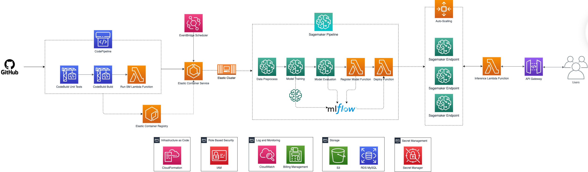
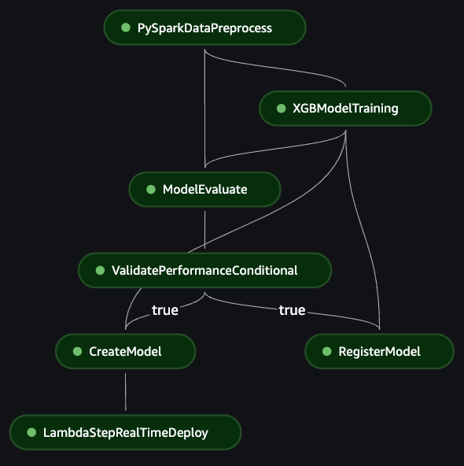
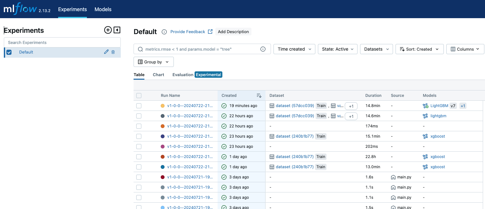
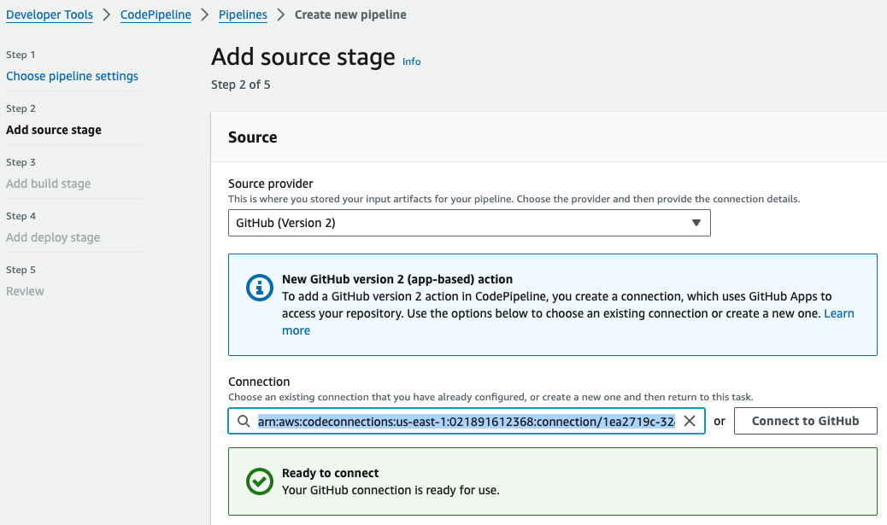

# Machine Learning End-to-End Case: Credit Fraud

## Index
1. [Introduction](#1-introduction)
    - [Overview](#overview)
    - [Key Components and Features](#key-components-and-features)
    - [Workflow](#workflow)
2. [Database](#2-database)
    - [About](#about)
    - [Organization](#organization)
    - [Download](#download)
3. [Project Organization](#3-project-organization)
4. [Architecture](#4-architecture)
    - [Technological Justification](#technological-justification)
    - [Architecture Overview](#architecture-overview)
        - [Continuous Integration](#continuous-integration)
        - [Model Pipeline](#model-pipeline)
        - [Models Algorithms](#models-algorithms)
            - [XGBoost](#xgboost)
            - [LightGBM](#lightgbm)
        - [Deployment](#deployment)
        - [Access Management](#access-management)
        - [Storage](#storage)
5. [Implementation Plan](#5-implementation-plan)
    - [Prerequisites](#prerequisites)
    - [Infrastructure From CloudFormation](#infrastructure-from-cloudformation)
6. [Configuration](#6-configuration)
    - [Parameters](#parameters)
        - [Global](#global)
        - [ECS](#ecs)
        - [Preprocess](#preprocess)
        - [Training](#training)
        - [Evaluation](#evaluation)
        - [Registry](#registry)
        - [Deployment](#deployment-1)
        - [APIGateway](#apigateway)
    - [Environment Variables](#environment-variables)
7. [Future Updates](#7-future-updates)
    - [AWS Account Segregation](#aws-account-segregation)
    - [Unit Tests Results Exportation](#unit-tests-results-exportation)
    - [VPC Isolation](#vpc-isolation)
    - [Implement EKS Replacing or Along With ECS](#implement-eks-replacing-or-along-with-ecs)
    - [AWS Ground Truth](#aws-ground-truth)
    - [Error Alerts](#error-alerts)
    - [Shadow Deployments](#shadow-deployments)
    - [Glacier for Long-Term Storage](#glacier-for-long-term-storage)
    - [Integrate with Grafana or Similar](#integrate-with-grafana-or-similar)
    - [Others](#others)
8. [References](#8-references)

## 1. Introduction
Machine learning algorithms offer means to analyze historical transaction data, identify patterns and detect anomalies indicative of fraudulent activities. These algorithms utilize features such as transaction amount, location, time, merchant details, history and customer behavior to train models capable of distinguishing between legitimate and fraudulent transactions

This document details the end-to-end Machine Learning Operations (MLOps) project designed for credit fraud detection. Will be described in detail the architecture and workflow of the project, which leverages AWS Cloud components, particularly Amazon SageMaker Pipelines, to automate and orchestrate the machine learning workflow.

Throughout this documentation, will be covered the key components and features of the project, the workflow involved, and the organization of the dataset used for training. Also, will be presented discussions over the project's architecture, including the technological justification for choosing AWS as the cloud provider.

### Overview
This document presents the architecture and workflow of an end-to-end Machine Learning Operations (MLOps) project designed for credit fraud detection. The project leverages AWS Cloud components, esecially Amazon SageMaker Pipelines, CodePipeline, CodeBuild and API Gateway to automate and orchestrate the machine learning workflow from data sourcing to model deployment. It incorporates Continuous Integration/Continuous Deployment (CI/CD), API deployment, and artifact management to ensure a robust and scalable solution.

### Key Components and Features
- [x] Data Sourcing: Data is sourced from Amazon RDS or S3
- [x] Artifact and Data Management: S3 serves as the primary persistent storage solution.
- [x] Model Training: Supports training with XGBoost and LightGBM models.
- [x] CI/CD: Utilizes AWS CodePipeline and CodeBuild, integrating with Githubs for continuous integration and deployment.
- [x] Unit Testing: Enable automatic unit tests with CodeBuild and PyTest.
- [x] Docker: Build Docker image for configuring and triggering SageMaker Pipeline steps and jobs, assuring stability and reproducibility.
- [x] SageMaker Pipeline Steps: Includes data preprocessing with Spark, model training, model evaluation (metrics estimation), SageMaker model creation, model registration with MLFlow (including metrics), and model deployment.
- [x] Automatic Deployment: Safely automatically updates running model deployment with AWS Auto-Scalling capabilities using Canary Strategy.
- [x] API Endpoint Deployment: Deploys endpoints for APIs to interact with the trained models using AWS API Gateway.
- [x] Security and Authentication: Includes essential credential validations, role based access with AWS IAM.
- [x] Logging and Pipeline Monitoring: AWS CloudWatch allows for full log observability of every component.
- [X] Automatic Execution: Regular training with Eventbridge Scheduler. 

### Workflow
- CI/CD Pipeline:
    - Automatically tracks merges on the target branch
    - AWS CodePipeline is used to automate the integration and deployment process.
    - A Docker image is built to manage SageMaker Pipeline steps.
- Full Containerized ML Model Job:
    - AWS ECS runs the container on code updates or regular schedules with AWS EventBridge Scheduler
- Data Sourcing and Preprocessing: 
    - Data is sourced from Amazon RDS or S3.
    - Preprocessing steps with PySpark are applied to clean and prepare the data for training.
    - Also supports Scikit-Learn.
- Model Training: 
    - Utilizes XGBoost and LGBM models for training.
    - Training is automated and managed through SageMaker Pipelines.
- Model Evaluation and Registration: 
    - Models are evaluated based on predefined metrics.
    - Models under the specified minimum performance are rejected.
    - Successful models are registered with MLFlow, including their performance metrics.
- Deployment: 
    - Models are deployed to SageMaker endpoints.
    - Automatic scaling is configured to handle varying loads.
    - API endpoints are deployed or updated to enable interaction with the model.

## 2. Database
### About
The dataset applied in this case is composed of features derived from credit card transactions of real clients, anonymized through the application of [Principal Component Analysis(PCA) method](#PCA) and available publicly online. The choice of this dataset is due to the following characteristics and interpretations:
- The dataset is highly reliable, clean and has the appropiate scale.
- Alignment with Santander field of interest.
- Simplicity, since many times in a real scenary the data scientist and the ML engineer will create pipelines over existing consolidated datasets.

### Organization
This dataset features are organized as the following schema:

| Time    | V1    | V2    | ... | V28   | Amount          | Class          |
| ------- | ----- | ----- | --- | ----- | --------------- | -------------  |
| Integer | Float | Float |     | Float | Unsigned Float  | Binary integer |

Where the columns can be further described as: 
- Time (int): Time in number of seconds elapsed between this transaction and the first transaction in the dataset, starting at 0 and ending in 172792. Ordered, positive and not unique.
- PCA Features (Float): Features V1 to V28, resulting from the PCA dimensionality reduction, representing the behaviour, history and profile of the client.
- Amount (Unsigned Float): Total amount for the operation. 
- Class (Binary Integer): Representation of the true class for the operation, either 0 for non-fraud or 1 for fraud.

### Download
The dataset is available directly from the [Kaggle source](#KaggleDataset). Later, this dataset must be uploaded to the prefered AWS source method, better described later on this documentation.

> [!WARNING]  
> The dataset was manually inserted in an equivalent table at the AWS RDS MySQL database.
> Since this setup is out of the scope of the case, the details won't be included.
>
> For testing, the more approachable source method for the project is to upload the data to AWS S3 and set it as the data source.

> [!NOTE]  
> A minor correction was performed in this dataset, since a single value of the `Time` column was filled with scientific notation and caused unexpected behaviours in some cases.
> The value was replaced by the non-scientific notation.

## 3. Project Organization
This project is fully developed for AWS Cloud deployment and integration, includes a python package called credit-fraud responsible for the Sagemaker pipeline and respective jobs.

- pyproject.toml: Main python configuration file for the credit-fraud package. Defines many setup variables like: Package modules, version and dependencies, as well as testing configurations, metadata and gui-script commands.
- setup.py: Used by pyproject.toml to install credit-fraud package.
- Dockerfile: Configurations used to build the docker image.
- start.sh: Initial commands for the docker image execution.
- testspec.yml: Setup for unit testing on the continuous integration pipeline. This file is usually managed in a separated repository.
- buildspec.yml: Setup for building the image on the continuous integration pipeline. This file is usually managed in a separated repository.
- .env: Default environment variables used on the project.
- credit_fraud: Source code for the credit-fraud package, including the Sagemaker pipeline configurations, jobs definitions, context functions and helpers.
- cloudformation: IaaC scripts and templates.
- tests: Unit tests used on the continuous integration phase
- models: Default models params directory, to be used when environment variables are left undefined.

## 4. Architecture
### Technological Justification
To fully attend the requisites presented, this case was designed to be entirely cloud-based since conception, thus four providers or any combination of then was considered: Databricks, AWS, Azure, GCP. Features considered included pricing, scalability, documentation quality, adherence to the project requisites, relevance for Santander, practicity, integrations, machine learning environment capabilities and personal experience. 

Ultimately, AWS alone was chosen as the provider. When implementing an end-to-end MLOps architecture, there are several reasons to choose AWS services:

1. **Scalability and Flexibility**: AWS provides a wide range of services that can scale seamlessly to handle large volumes of data and workloads. This scalability allows for efficient training and deployment of machine learning models, ensuring that the architecture can handle increasing demands. Every component integrated is either horizontally scalable or serverless.

2. **Integration and Compatibility**: AWS services are designed to work together seamlessly, allowing for easy integration and compatibility between different components of the MLOps architecture. This ensures smooth data flow and efficient communication between services, reducing development and maintenance efforts. Due to this, multi-cloud architecture was less viable.

3. **Security and Compliance**: AWS offers a wide range of security features and compliance certifications, ensuring that the MLOps architecture meets industry standards and regulatory requirements. This includes encryption, access control, audit logging, and compliance with data protection regulations.

4. **Monitoring and Logging**: AWS provides robust monitoring and logging services, such as CloudWatch, that enable real-time monitoring of the MLOps architecture. This allows for proactive identification and resolution of issues, ensuring high availability and performance of the system.

Besides that, it's also worth noting the developer's own personal experience, on which previous works and trainings were helpful to accomplish the desired implementation and avoid pitfalls and errors. 

In conclusion, choosing AWS services like Amazon SageMaker, Amazon ECS, Amazon S3, Amazon RDS, and others for implementing an end-to-end MLOps architecture provides scalability, flexibility, integration, and compatibility. These services simplify the development and deployment of machine learning models, ensure efficient data storage and management, and offer robust security and monitoring capabilities.

### Architecture Overview

The full proposed architecture is depicted above, omitting some minor operations like data persisting, logging and components communications for better comprehension. This architecture is mainly composed of three phases: Continuous Integration, Model Pipeline and Deployment.

#### Continuous Integration
Starting with a successful merge from any source branch to the development branch of the Github repository, the AWS CodePipeline is automatically triggered for a new integration run. The updated repository is collected containing the necessary configurations for the pipeline run. This pipeline is mainly serverless or using IaaC to define computation resources.

Initially, CodeBuild is invoked for unit testing as defined in `testspec.yml` file and configured in `tool.pytest.ini_options` section of the `pyproject.toml` file. The results are registered in a report of the AWS CodeBuild task, and can be acessed by authorized users for analysis. Finally, if the tests fail for any given reason, the pipeline run will also fail and be interrupted immediately. At the moment, even though the testing functionality is developed and integrated, there are few tests and the coverage is very low.

Following the approval of the new code, the build phase aiming to create a new Docker container image is started, also powered by the AWS CodeBuild service and configured by the `Dockerfile` and `buildspec.yml` files. On a successful build, the new image is registered on a repository of the AWS Elastic Container Registry (ECR). As expected if the build fails, the pipeline run will be interrupted and the logs for debugging will be available on AWS CloudWatch. 

It's worthy noting that the built image will be registered with the tag related to the project version, defined in the `pyproject.toml` file. The semantic version control adhesion is, therefore, responsability of the pull request assignees, according to the performed changes and updates.

Concluding the run is the invocation of the AWS Lambda function responsible for updating and triggering the AWS Elastic Container Service (ECS) task with the newly built image. As declared in the file `credit_fraud/lambda_functions/sources/lambda_run_pipeline.py`, this Lambda function updates the ECS task definition with the new image URI of the ECR repository, runs this updated task and label as successful the CodePipeline run.

Outside of the continuous integration pipeline, AWS Eventbridge Scheduler is responsible for daily running the training of the model, keeping the model updated as soon as new data is available. This schedule can be customized, tracked and new triggers could be added if needed, like new data being made available.

#### Model Pipeline
The Docker image is responsible for the configuration and deployment of a Sagemaker Pipeline that will perform compute demanding tasks like data processing and model training, requiring horizontally scalable resources. This pipeline is highly customizable using environment variables, and is represented with specific configurations, performing LGBM model training and deployment as follows:

Every pipeline run receives a unique `execution_id`, responsible for identifying the run and isolating its scripts, processed data and artifacts when persisting in the AWS S3 bucket.

Starting with the spawning of data preprocessing instances in a cluster, this task default processing module is PySpark, but Scikit-Learn is also supported. The updated data is read into the instances, processed, split into train, validation and test sets and saved into the AWS S3 run folder, inside the `{execution_id}/processed` directory. This task can be scaled horizontally and vertically as needed, and the Spark configurations are automatically setup according to the detected hardware.

Following the successful processing of data, the model training supports both XGBoost and LGBM models. Using the training and validation set, the model artifact is trained, evaluated and has its artifacts saved to the AWS S3 bucket `execution_id` folder. Aditionally, the experiment run is registered into a new MLFlow experiment along with its validation metrics.

The model is further evaluated in the dedicated evaluation task using the test dataset, and the test metrics are also registered into the MLFlow experiment. These test metrics are used in the conditional validation gate to assure the efficiency of the new model before deployment, otherwise aborting the pipeline run and logging the reason of the bellow expected metric or metrics into AWS CloudWatch for debugging.

Finally, once approved, the model is registered on the MLFlow and created on Sagemaker as a deployable model with definitions referencing the container image, artifact URI address and preferable instance resources. By registering the model on the MLFlow, it is automatically also registered on the Sagemaker Studio Model interface, allowing for aggregated overview along with the pipeline.

> [!NOTE]  
> [MLFlow was recently integrated officialy into Sagemaker](#MLFlowSagemaker), actually announced during the development of this project, so it's not fully supported by every functionality.
> Specific changes were necessary to deal with some limitations, like installing MLFlow manually in some containers to avoid re-building then

#### Models Algorithms
##### XGBoost
XGBoost model, also referenced as `xgb` model on the source code, is implemented using [Sagemaker's customized XGBoost framework](#SagemakerXGBoost), that includes containers for training and inference. The training script is located at `credit_fraud/pipeline/jobs/xgboost/train.py`, and default parameters are found on the `models/xgboost_default.json` file. Model parameters can be defined without the need of generating a new image, [by using environment variables to override default values](#environment-variables).

##### LightGBM
LightGBM or LGBM, referenced as `lgbm` model on the source code, is implemented with an edited version of [Sagemaker's built-in algorithm](#SagemakerLGBM). The changes revolve around supporting MLFlow logging. Similarly to the XGBoost model, model parameters can be overridden, the training files can be found at the `credit_fraud/pipeline/jobs/lgbm` directory, and default parameters are stored on `models/lgbm_default.json` file. 

#### Deployment
The deployment uses AWS Auto-Scalling to guarantee incoming requests load balancing and that the minimum expected instances of the Sagemaker Endpoints are running and healthy, and scales automatically on periods of higher workloads, up to a maximum. Assuming that the endpoint is expected to be online undefinitely, the [Canary Update strategy](#CanaryUpdate) is performed when updated models are available and perform smooth endpoint deployments over the existing structure. This strategy guarantees that the new updated endpoints are running and healthy before definitely replacing and disabling the outdated instances.

Upon the invocation of the deployment Lambda Function on the last step of the Sagemaker Pipeline, the created model is used to define a new endpoint definition. During the endpoint update, the pipeline awaits its conclusion to finish succesfully. The endpoints become available internally to authorized users, and can be invoked directly for testing or development purposes.

The final two components of the deployment are the inference AWS Lambda function and the AWS API Gateway, both serverless and thus highly scalable. While the API Gateway is a router API that works as the public access for users, it acts like a proxy and directs requests to the Lambda function, including the body containing the input data for the model assessment. This Lambda function is responsible for the processing according to the endpoint interface, that may differ between the chosen model (XGBoost or LGBM), and invocation of the given endpoint. The resulting response is processed and returned to the client.

#### Access Management
AWS IAM role-based access authorizes components to perform the necessary operations. Access to the model endpoint is authenticated using AWS credentials. Access roles and policies are created using Cloudformation for this case, but in a real production environment, these should be managed by the security and authorization team. Ideally, created roles include only the necessary policies to authorize its expected actions and responsabilities

The API Access is limited to the API Key created automatically with CloudFormation, and available at the AWS API Gateway management console. This security method, besides being simple, is effective, safe and coupled with the usage plan that policies the key usage and limit its request rate. New keys can be generated if needed.

#### Storage
Mainly, AWS S3 is used to store most objects, including underlying metadata and other data automatically generated by some components. Every model pipeline run has its artifacts, input data, processed data, scripts, metrics and general metadata registered on the S3 for reproductibility. The S3 bucket name and directory prefix defined on `.env` are used as base path for data persisting.

Additionally, container images are registered on the AWS ECR service during the build phase, and are named using the project version. It's expected that the semantic version is managed during merge requests, either manually or using tools like Github Actions.

Finally, every component log is directed to AWS Cloudwatch for registry and eventual debugging. 

## 5. Implementation Plan
> [!NOTE]  
> Tested on us-east-1 region.

> [!WARNING]
> Not every component may be eligible for AWS Free Tier.

### Prerequisites
- Bash terminal with AWS CLI configured
    - Requires Cloudformation and IAM Role creation access.
- Copy `.env.example` as `.env`. 
    - Values will need to be filled as instructed on the [Environment Variables section](#environment_variables).
- [Configure Sagemaker Domain.](#SagemakerDomain).
    - For this project tests, single user setup was utilized.
    - Take note of the S3 bucket name and write it to the `.env`. In case the bucket don't appear in this page, check in the S3 page. Optionally, any bucket can be used.
    - Take note of the VPC ID and write it to the `.env`. Otherwise, a different VPC can be utilized for process better isolation.
- [Configure Sagemaker's MLFlow Tracking Server](#SagemakerMLFlowSetup).
    - Take note of the server ARN and write it to the `.env`.
> [!WARNING]
> MLFlow server at the moment is highly expensive, turn it off when it's not being used.
- [Connect AWS to Github account.](#AWSGithub)
    - The easiest method for this at the moment is to simulate the creation of a new AWS Code Pipeline, and stop on Step 2 after connecting to GitHub (Version 2). You don't have to finish the creation of the pipeline.
    - This connection requires the creation of a Github application with the repository.
    - Take note of the connection ARN and write it to the `.env`
    
- Insert source data csv file on the selected source.
    - For S3 source option, default value is specified in [the environment variables detailed sections.](#environment-variables)
    - For RDS source option, create a database `credit_fraud` with table `transactions` containing data with the same columns to the original file.
> [!NOTE]  
> The S3 source is recommended for simplified tests.

### Infrastructure From CloudFormation
The infrastructure as code is deployed according to the templates on `cloudformation` directory, using configurations from `config.yaml` and most of the required environment variables from `.env`.

Script `cloudformation/install.sh` performs the installation of the stacks, while `cloudformation/uninstall.sh` can be used to uninstall the stacks. Stacks can also be updated if needed, but these would require specialized intervention.

> [!NOTE] 
> This installation was tested on Mac OS and Ubuntu.
>
> In case the stack instalation fail for any reason, delete all the stacks individually.
> The `storage-stack` don't delete any resource when uninstalled to avoid loss of data. Delete manually if needed to re-install this stack.

After that, simply merge to the project repository to start the integration pipeline, process data, train the model, evaluate and deploy the model endpoint.

### Debugging
Most possible failures can be located on the components dashboards and with more details on the logs of Cloudwatch:
- Cloudformation installation failures are located on its console, separated by stack.
- Errors on the Continuous Integration phase may be located on the CodePipeline dashboard and its Cloudwatch log streams.
- Errors of triggering the model pipeline are found on the ECS task dashboard and its Cloudwatch log streams.
- Model Pipeline failures are found on the Sagemaker Studio, at the "Pipelines" section.

## 6. Configuration
### Parameters
The `config.yml` file outlines various settings for the MLOps pipeline, detailing configurations for preprocessing, training, evaluation, and deployment phases. These settings are used on both the Sagemaker Pipeline, under the `context` object, and CloudFormation stack installations. Fundamentally, these configurations are expected to change less, and never hold any kind of sensible value, so they are defined on the image during the build phase. 

Every parameter is allocated inside a parameter group, that is required when referencing it. Exceptionally, the `config.yaml` is read as environment variables during the CloudFormation instalation, and parameters are referenced using the parameter group as the prefix, separated by an underline. These groups are defined as follows:

> [!WARNING]
> Many instances types and counts are limited by AWS Service Quota, [and its usage must be requested.](#AWSQuota)

#### Global
- **PipelineName:** Specifies the name of the Sagemaker Pipeline. 
- **BaseJobNamePrefix:** Base prefix used for naming jobs within the pipeline.
- **JobsScriptsFolder:** The directory where job scripts are stored, indicating the location of the code that executes pipeline steps.

#### ECS
- **RunPipelineLambdaFunctionName:** The name of the Lambda function responsible for triggering the Sagemaker Pipeline execution.
- **ECSTaskDefinitionName:** Defines the name of the ECS task definition, which specifies the Docker container and settings for the task.

#### Preprocess
- **SourceMethod:** Indicates the source of the data. Accepts `rds` or `s3`.
- **PreprocessFramework:** The framework used for preprocessing data. Accepts `pyspark` or `scikit-learn`.
- **PreprocessSklearnInstanceType:** Specifies the instance type used for preprocessing tasks that utilize Scikit-learn. This job uses a single instance. Consult instance types available on the region.
- **PreprocessPysparkInstanceType:** Defines the instance type for PySpark preprocessing tasks, indicating a larger instance size for handling Spark jobs. Consult instance types available on the region. Recommended to only use instances with memory equal or higher than 8GB.
- **PreprocessPysparkInstanceCount:** The number of instances used for parallel PySpark preprocessing. The cluster is configured automatically.
- **TrainRatio:** The proportion of the dataset allocated for training.
- **ValidationRatio:** The proportion of the dataset allocated for validation.
- **TestRatio:** The proportion `0.2` of the dataset allocated for testing.
> [!IMPORTANT]  
> The sum of train, validation and test ratios must be **exactly** equal to 1.

#### Training
- **DefaultTrainingAlgorithm:** Specifies the default machine learning algorithm used for training the model. Can be overridden by the environment variable TRAINING_ALGORITHM. Accepts `xgboost` or `lgbm`.
- **XGBoostFrameworkVersion:** The version of the XGBoost framework used, ensuring compatibility and feature availability.
- **TrainInstanceType:** The instance type used for the training job, indicating the computational resources allocated. Consult instance types available on the region.
- **TrainInstanceCount:** The number of instances used for the training job, specifying if it's a single-instance training process or cluster-based.

#### Evaluation
- **EvaluateInstanceType:** The instance type used for the evaluation job, indicating the resources allocated for model evaluation. Consult instance types available on the region.
- **ROCAUCMinThreshold:** The minimum threshold for the ROC AUC metric, determining the acceptable performance level for the model. The model is declined if evaluated below this metric.

#### Registry
- **RegisterModelLambdaFunctionName:** The name of the Lambda function responsible for registering the trained model, both on MLFlow and Sagemaker basic model registry.

#### Deployment
- **EndpointName:** Name of the endpoint. Used as reference to request inferences.
- **DeployInstanceType:** The instance type of the model as the endpoint.
- **DeployModelMinCapacity:** Minimum available instances of the model at any moment, to be managed by the AWS Auto-Scalling. Required to be one or higher.
- **DeployModelMaxCapacity:** Maximum available instances of the model at any moment, to be managed by the AWS Auto-Scalling. Required to be higher than the minimum.
- **DeployLambdaFunctionName:** The name of the Lambda function responsible for deploying the updated model.

#### APIGateway
- **InferenceEndpointLambdaFunctionName**: The name of the Lambda function for the inference route. Used as reference by the API Gateway.
- **InferenceHealthLambdaFunctionName**: The name of the Lambda function for the health route. Used as reference by the API Gateway.

### Environment Variables
The `.env` file must be defined using the `.env.example` and has required and optional fields. Before running the installation with CloudFormation, it's essential to fill the required values in order to corretly setup the components and avoid errors. Supported environment variables are: 

- **GITHUB_CONNECTION_ARN:** ARN of the GitHub CodeStar Connection. [This connection must be created manually](#AWSGithub) before the ARN can be obtained.
- **GITHUB_REPOSITORY_NAME:** Name of the GitHub Repository. Must follow the format "OWNER/REPOSITORY".
- **MAIN_BRANCH_NAME:** Main branch to track updates and trigger CI/CD pipeline.
- **AWS_REGION:** AWS Region to deploy. If not informed, will be inferred from the AWS credentials.
- **AWS_SAGEMAKER_S3_BUCKET_NAME:** AWS S3 bucket to store any data or artifact.
- **AWS_SAGEMAKER_S3_BUCKET_NAME_FOLDER_PREFIX:** Prefix for the stored data on AWS S3.
- **MLFLOW_ARN:** MLFlow unique ARN. [This connection must be created manually](#SagemakerMLFlowSetup) before the ARN can be obtained.
- **VPC_ID:** VPC identificator for running multiple tasks. Can be the same of the Sagemaker Domain.
- **CRON_SCHEDULE:** Cron schedule to regularly run pipeline for training and deploy.
- **RDS_HOST_URL:** (Optional) Host URL for the RDS MySQL database. Not necessary when using S3 source.
- **RDS_SECRET_NAME:** (Optional) Secret name from AWS Secret Manager to access RDS MySQL database. Not necessary when using S3 source.
- **AWS_SAGEMAKER_ROLE_IAM:** (Opcional) Define a custom IAM Role for Sagemaker. Otherwise, uses the default role generated by Cloudformation.
- **S3_RAW_DATA_KEY:** (Optional) Location of the source csv file with the raw data when using S3 as source. Default value is s3://\<AWS_SAGEMAKER_S3_BUCKET_NAME\>/\<AWS_SAGEMAKER_S3_BUCKET_NAME_FOLDER_PREFIX\>/raw/creditcard.csv
- **TRAINING_ALGORITHM:** (Optional) Select the training algorithm. Overrides default configuration.
- **XGBOOST_\<VARIABLE\>:** (Optional) Any environment variable with this prefix will be used to override default hyperparameter values of the XGBoost model.
- **LGBM_\<VARIABLE\>:** (Optional) Any environment variable with this prefix will be used to override default hyperparameter values of the LightGBM model.

## 7. Future Updates
### AWS Account Segregation
It's recommended by the AWS Well Architected Framework to [separate accounts based on function](#AWSAccountSegregation), creating an hard barrier between environments. This would be useful in the context of this project not only to safely isolate development and production environments and assert its responsabilities, but to keep this project separated from others of the corporation, avoiding any conflicts.

### Unit Tests Full Coverage and Results Exportation
Unit tests evaluation and coverage reports are automatically created on the CI phase and stored on S3, but there is no further exportation for this data, and the general user will need access to this report directly. To sort this out, some solution like [Sonarqube integrated with CodePipeline](#SonarqubeCP) could be developed, safely delivering these reports to the user domain. 

Besides that, there are few effective tests implemented at the moment, so it's necessary to develop the unit tests for full coverage of the project for every essential feature.

### VPC Isolation
Similar to account segregation, Virtual Private Clouds, or VPC, [are powerful tools for achieving component isolation by creating private networks for the communication of components](#VPCConnection). They are currently used in this project along with its subnets, in a simplified implementation. Ideally, development, pre-production and production environments will have exclusive VPCs, and very little communication will happen between then. For example, even on separated networks, development continous deployment would be able to trigger the latest update on the pre-production pipeline automatically.

### Implement EKS Replacing or Along With ECS
ECS offers the ideal serverless solution for small and medium corporations, but for big enterprises with existing Kubernetes, [EKS should be considered as a option over ECS, or along with it](#EKSVSECS). While similar, ECS offers greater simplicity and cost viability under its "pay-as-you-use" model, and EKS presents the best stability and usual features of full Kubernetes deployments. Both of then have many options for the computing, and can be used together seamlessly.

### AWS Ground Truth
AWS Ground Truth simplifies the process of labeling the credit fraud dataset with feedbacks, which is crucial for training an fast and more accurate machine learning model training. [It provides a user-friendly interface for annotators to label the data, ensuring consistency and quality in the labeled dataset](#AWSGT). 

A great advantage of AWS Ground Truth is its integration with Amazon SageMaker, the machine learning platform used in the pipeline. The labeled dataset generated by AWS Ground Truth can be directly used as training data in SageMaker, eliminating the need for manual data preprocessing and conversion. This integration streamlines the end-to-end machine learning workflow, saving time and effort for the data scientists.

### Error Alerts
Direct alerts to the user would be useful in many cases: Unit tests performance failure, trained model metrics below minimum threshold, failure to deploy, and many others. There is the option to [integrate with Microsoft Teams and notify the user there](#Teams).

### Shadow Deployments
By implementing shadow deployments, [that are natively supported by Sagemaker](#SagemakerShadowDeployment), you can create a replica of the production environment where you can test new versions of the model without impacting the live system. This allows you to evaluate the performance and behavior of the new model in a real-world scenario, without exposing it to actual users or affecting the production system. In the context of the credit fraud inference, it's desired to assure the model's efficience as soon as possible, and shadow deployments minimize the risks associated with deploying untested or unverified models.

### Glacier for Long-Term Storage
Due to the requisite to store training and testing data for every model, that may take significant storage space, it may be interesting to automatically store this data into [S3 Glacier for long-term safe-keeping with the lowest costs](#S3Glacier).

### Integrate with Grafana or Similar
Integration with any visual observalibilty platform, like Grafana or Kibana, would centralize data into accessible dashboards for the general user visualization. At the moment, logs, pipeline runs, model deployments and many metrics are monitored with many different tools, like CloudWatch, MLFlow, Sagemaker Model Registry and the component's own dashboards. Ideally, this data could be funneled to a single platform for optimal monitoring.

### Others
- Optimize Latency: Accelerate model inference and optimize latency to enhance API performance
- Multi-Zone Deployment: Maximize model availability with multi-zone deployment, avoiding disruption even on extreme conditions.
- API Access Management Refinement: Implement further access management options that allows for more authentication methods, like API Gateway Authenticators.

## 8. References
<a id="KaggleDataset">[Kaggle Credit Fraud Dataset]</a>
"Credit Card Fraud Detection".
https://www.kaggle.com/datasets/mlg-ulb/creditcardfraud (Available on 23/07/2024)

<a id="SagemakerDomain">[Sagemaker Domain]</a>
AWS Team.
"Quick setup to Amazon SageMaker".
Amazon Web Services, Inc.
https://docs.aws.amazon.com/sagemaker/latest/dg/onboard-quick-start.html (Available on 24/07/2024)

<a id="PCA">[PCA]</a> 
Svante Wold, Kim Esbensen, Paul Geladi.
"Principal component analysis".
Chemometrics and Intelligent Laboratory Systems,
Volume 2, Issues 1–3,
1987,
Pages 37-52,
ISSN 0169-7439,
https://doi.org/10.1016/0169-7439(87)80084-9.

<a id="CanaryUpdate">[Canary Update]</a> 
Danilo Sato.
"Canary Release"
Thoughtworks.
https://martinfowler.com/bliki/CanaryRelease.html?ref=wellarchitected (Available on 01/07/2024)

<a id="SagemakerXGBoost">[Sagemaker XGBoost]</a>
AWS Team.
"Use the XGBoost algorithm with Amazon SageMaker".
Amazon Web Services, Inc.
https://docs.aws.amazon.com/sagemaker/latest/dg/xgboost.html (Available on 22/07/2024)

<a id="SagemakerLGBM">[Sagemaker LGBM]</a>
AWS Team.
"LightGBM".
Amazon Web Services, Inc.
https://docs.aws.amazon.com/sagemaker/latest/dg/lightgbm.html (Available on 24/07/2024)

<a id="AWSGithub">[AWS Github Connection Setup]</a>
AWS Team.
"GitHub connections".
Amazon Web Services, Inc.
https://docs.aws.amazon.com/codepipeline/latest/userguide/connections-github.html (Available on 27/07/2024)

<a id="SagemakerMLFlowSetup">[Sagemaker MLFlow Setup]</a>
AWS Team.
"Create an MLflow Tracking Server".
Amazon Web Services, Inc.
https://docs.aws.amazon.com/sagemaker/latest/dg/mlflow-create-tracking-server.html (Available on 27/07/2024)

<a id="AWSAccountSegregation">[AWS Account Segregation]</a>
AWS Well Architected Framework Team.
"AWS Account Management and Separation".
Amazon Web Services, Inc.
https://docs.aws.amazon.com/wellarchitected/latest/security-pillar/aws-account-management-and-separation.html (Available on 27/07/2024)

<a id="SonarqubeCP">[Sonarqube on AWS Code Pipeline]</a>
Karthik Thirugnanasambandam
"Integrating SonarCloud .ith AWS CodePipeline using AWS CodeBuild".
AWS DevOps Blog
https://aws.amazon.com/pt/blogs/devops/integrating-sonarcloud-with-aws-codepipeline-using-aws-codebuild/ (Available on 01/08/2024)

<a id="VPCConnection">[AWS VPC Sharing]</a>
AWS Team.
"VPC Sharing".
Amazon Web Services, Inc.
https://docs.aws.amazon.com/whitepapers/latest/building-scalable-secure-multi-vpc-network-infrastructure/amazon-vpc-sharing.html (Available on 01/08/2024)

<a id="EKSVSECS">ECS Vs EKS</a>
Deepak Singh.
"Amazon ECS vs Amazon EKS: making sense of AWS container services".
Amazon Web Services, Inc.
https://aws.amazon.com/pt/blogs/containers/amazon-ecs-vs-amazon-eks-making-sense-of-aws-container-services/ (Available on 01/08/2024)

<a id="AWSGT">[AWS Ground Truth]</a>
AWS Team.
"Labeling training data using humans via Amazon SageMaker Ground Truth".
Amazon Web Services, Inc.
https://docs.aws.amazon.com/sagemaker/latest/dg/sms.html (Available on (02/08/2024))

<a id="Teams">[Microsoft Teams Integration]</a>
Sébastien Stormacq.
"AWS Chatbot Now Integrates With Microsoft Teams"
Amazon Web Services, Inc.
https://aws.amazon.com/pt/blogs/aws/aws-chatbot-now-integrates-with-microsoft-teams (Available on 02/08/2024)

<a id="SagemakerShadowDeployment">[Sagemaker Shadow Deployment]</a>
AWS Team.
"Shadow Variants"
Amazon Web Services, Inc.
https://docs.aws.amazon.com/sagemaker/latest/dg/model-shadow-deployment.html (Available on 02/08/2024)

<a id="S3Glacier">[More about AWS S3 Glacier]</a>
AWS Team.
"AWS S3 Glacier Storage Classes".
Amazon Web Services, Inc.
https://aws.amazon.com/pt/s3/storage-classes/glacier/ (Available on 02/08/2024)

<a id="AWSQuota">AWS Service Quota</a>
AWS Team.
"Requesting a quota increase"
Amazon Web Services, Inc.
https://docs.aws.amazon.com/servicequotas/latest/userguide/request-quota-increase.html (Available on 04/08/2024)

<a id="MLFlowSagemaker">MLFlow on Sagemaker</a>
Veliswa Boya.
"Announcing the general availability of fully managed MLflow on Amazon SageMaker"
AWS News Blog.
https://aws.amazon.com/pt/blogs/aws/manage-ml-and-generative-ai-experiments-using-amazon-sagemaker-with-mlflow/ (Available on 04/08/2024)